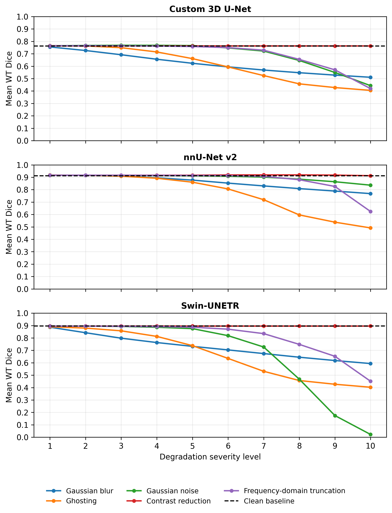
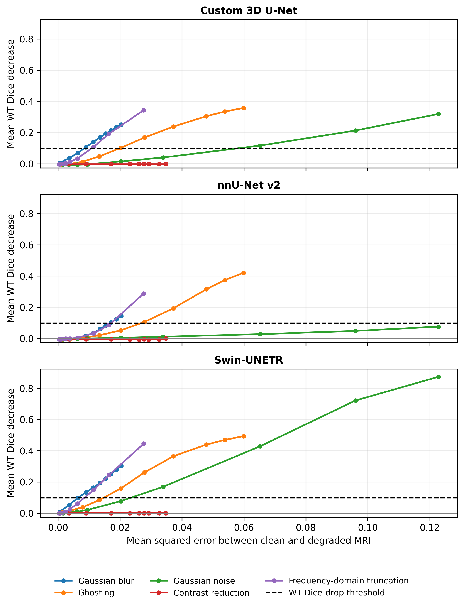
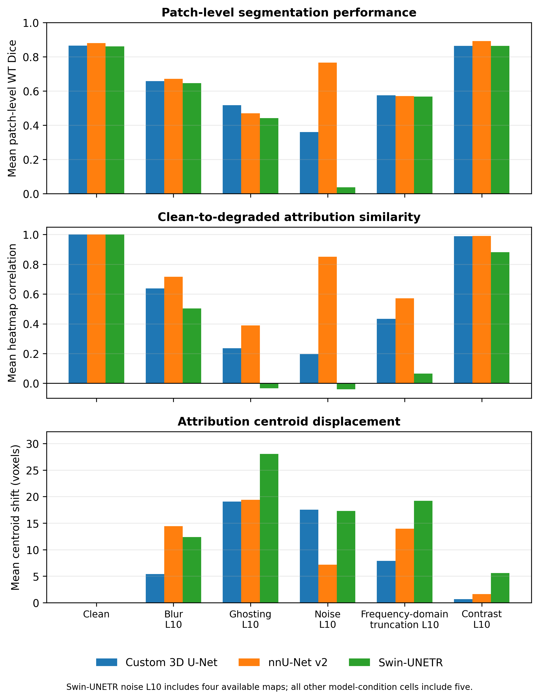
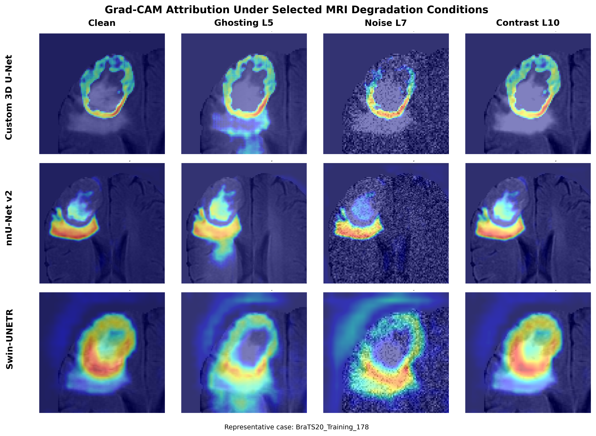
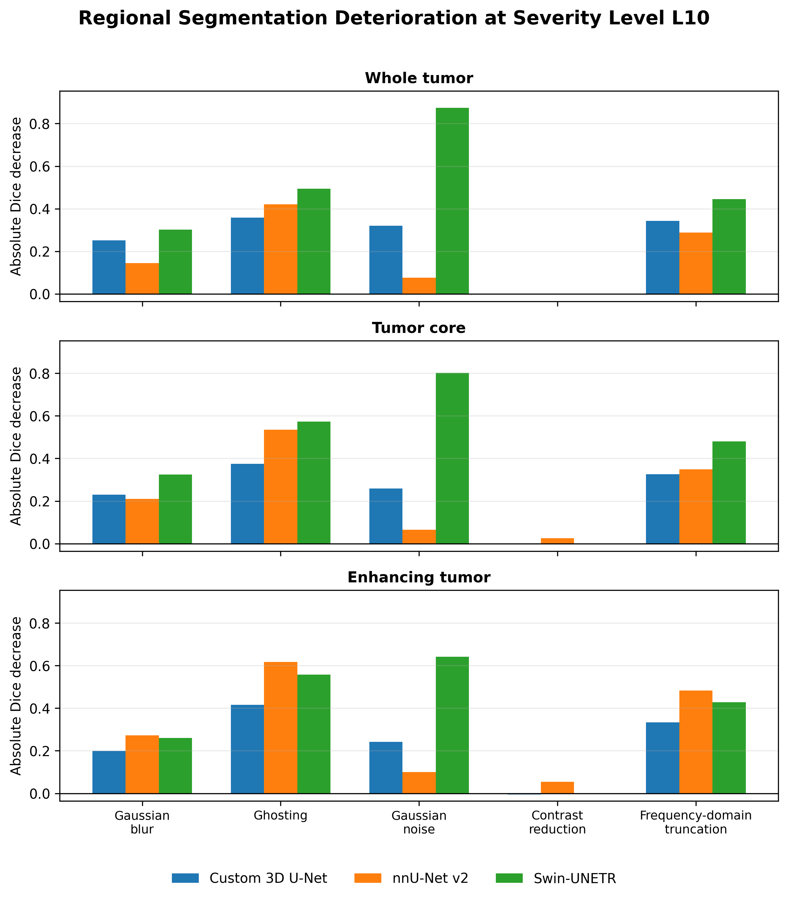

# Robustness and Spatial Attribution of Deep Learning Models for Brain Tumor Segmentation Under MRI Degradations

This repository contains code, result summaries, and selected figures from a CS 5395 independent study evaluating the robustness of three brain-tumor-segmentation workflows under controlled MRI degradation.

## Evaluated workflows

- Custom 3D U-Net
- nnU-Net v2
- Swin-UNETR

This study compares **complete segmentation workflows**, not isolated architectures. The workflows differ in preprocessing, normalization, augmentation, optimization, patch sampling, checkpoint selection, inference, and postprocessing. Results therefore should not be attributed to architecture alone.

## Dataset and task

The study used the BraTS2020 training collection:

- 368 usable subjects
- 294 development subjects
- 74 held-out test subjects
- Four MRI modalities: FLAIR, T1, T1ce, and T2

Segmentation was evaluated for:

- **WT:** whole tumor
- **TC:** tumor core
- **ET:** enhancing tumor

All models were trained on clean MRI data and evaluated on the same held-out test cohort.

## MRI degradation framework

Five degradation families were introduced only during testing:

1. Gaussian blur
2. Ghosting
3. Gaussian noise
4. Contrast reduction
5. Frequency-domain truncation

Each degradation was evaluated from L1 through L10. These levels represent increasingly severe controlled test conditions, not clinically standardized artifact grades.

## Evaluation measures

The study used:

- Dice similarity coefficient
- Intersection over union
- Absolute and relative Dice decrease
- Mean squared error
- Peak signal-to-noise ratio
- Grad-CAM heatmap correlation
- Grad-CAM centroid displacement

The study-defined practical breaking threshold was reached when the absolute WT Dice decrease was at least 0.10 or the absolute WT IoU decrease was at least 0.15. This was a descriptive experimental threshold, not a clinically validated safety threshold.

## Main results

### Clean full-volume performance

| Workflow | WT Dice | WT IoU | TC Dice | ET Dice | Macro Dice |
|---|---:|---:|---:|---:|---:|
| Custom 3D U-Net | 0.7628 | 0.6379 | 0.6531 | 0.5894 | 0.6684 |
| nnU-Net v2 | **0.9125** | **0.8462** | **0.8844** | **0.8186** | **0.8718** |
| Swin-UNETR | 0.8962 | 0.8186 | 0.8470 | 0.7417 | 0.8283 |

### First practical breaking level

| Degradation | nnU-Net v2 | Swin-UNETR | Custom 3D U-Net |
|---|---:|---:|---:|
| Gaussian blur | L8 | L4 | L4 |
| Ghosting | L6 | L5 | L5 |
| Gaussian noise | None through L10 | L7 | L8 |
| Contrast reduction | None through L10 | None through L10 | None through L10 |
| Frequency-domain truncation | L10 | L8 | L8 |

## Main findings

- nnU-Net achieved the strongest clean performance and overall robustness in this experiment.
- No workflow was robust to every degradation.
- Ghosting and frequency-domain truncation were broadly damaging.
- Gaussian noise produced the largest difference among workflows.
- nnU-Net remained comparatively stable under Gaussian noise.
- The custom 3D U-Net declined substantially under severe noise.
- The evaluated Swin-UNETR workflow approached complete failure under severe noise.
- Contrast reduction produced little change because the implemented multiplicative scaling was largely canceled by normalization.
- MSE and PSNR did not consistently predict segmentation deterioration.
- WT, TC, and ET did not always deteriorate in the same way.
- Severe degradation also changed Grad-CAM attribution patterns.

## Selected figures

### Whole-tumor Dice across degradation levels

### Image distortion versus Dice decrease

### Severe-condition Grad-CAM results

### Representative Grad-CAM overlays

### Regional deterioration at L10

## Interpretation limits

- The comparison was conducted at the complete-workflow level.
- One validation-selected checkpoint was evaluated per workflow.
- Models were not repeatedly trained using multiple random seeds.
- Cross-workflow comparisons were descriptive.
- Degradations were synthetic and not clinically calibrated.
- Grad-CAM was evaluated using five selected subjects and fixed patches.
- Grad-CAM does not provide a causal explanation of model reasoning.
- These results do not establish clinical deployment readiness.

## Repository contents

- `scripts/`: data preparation, training, evaluation, degradation, Grad-CAM, and plotting
- `results/`: compact CSV, JSON, and text summaries
- `report_materials/`: final figures and report-ready outputs

Raw BraTS MRI data, generated NIfTI files, prediction masks, and model checkpoints are not included.

## Project information

**Course:** CS 5395 Independent Study  
**Institution:** Texas State University  
**Prepared by:** Syeda Tasmi Faria  
**Advisor:** Dr. Mylene Queiroz de Farias  
**Completed:** August 2026
